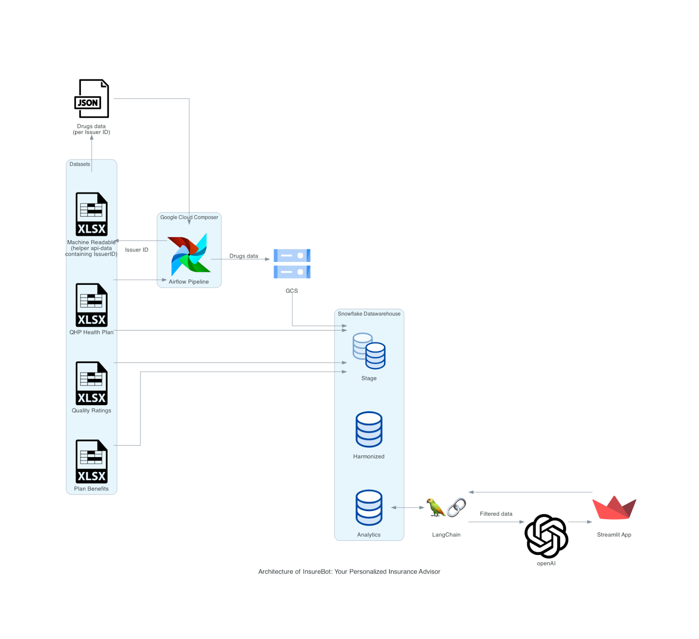
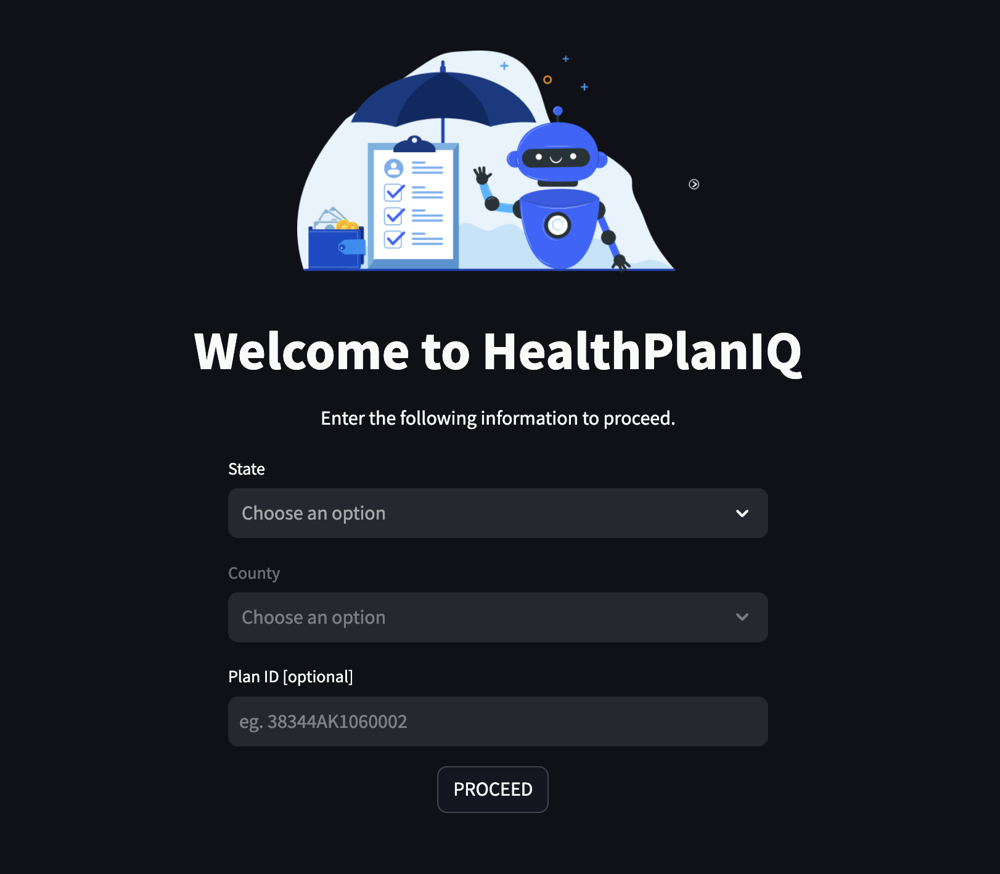
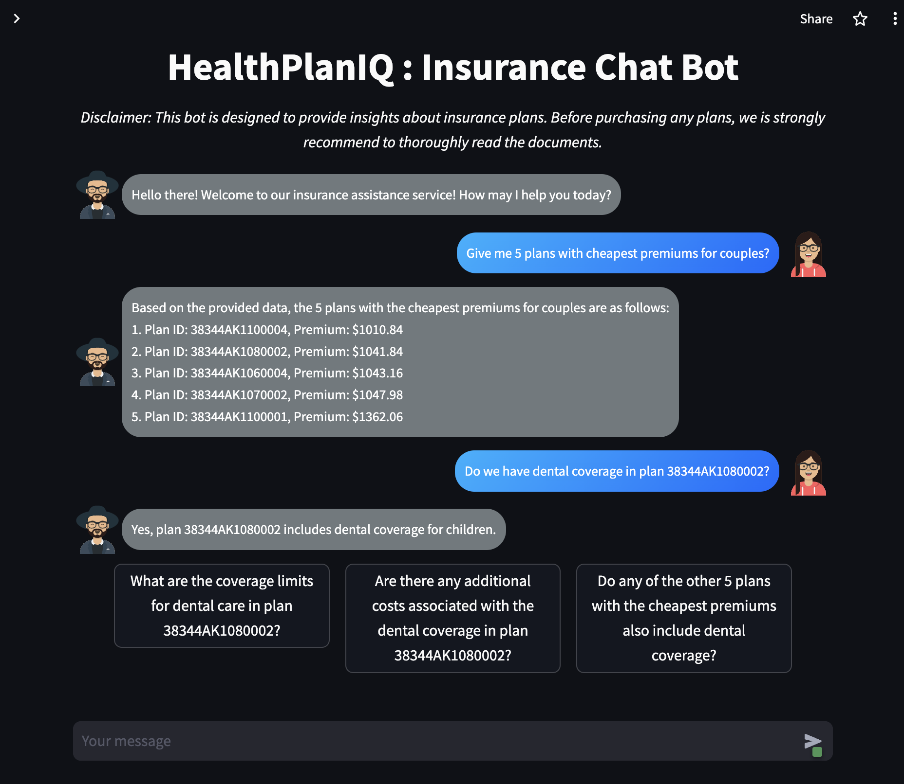
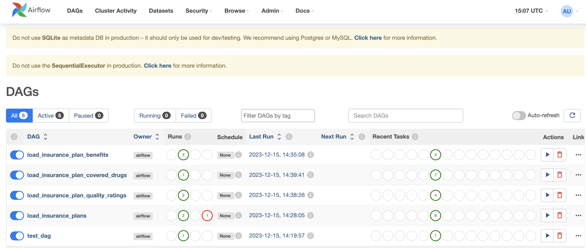
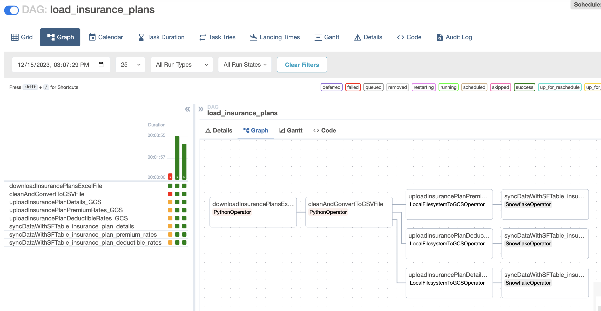
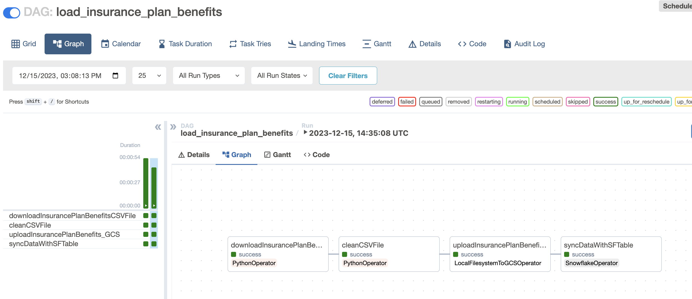
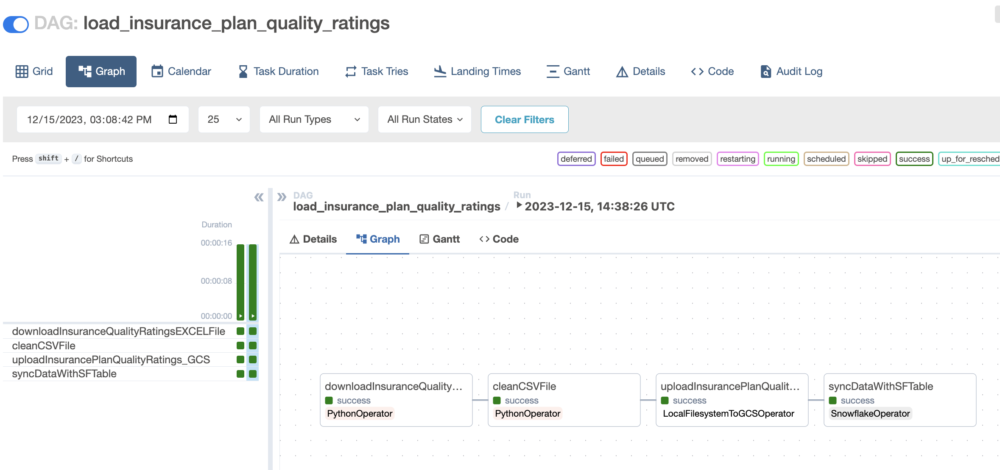
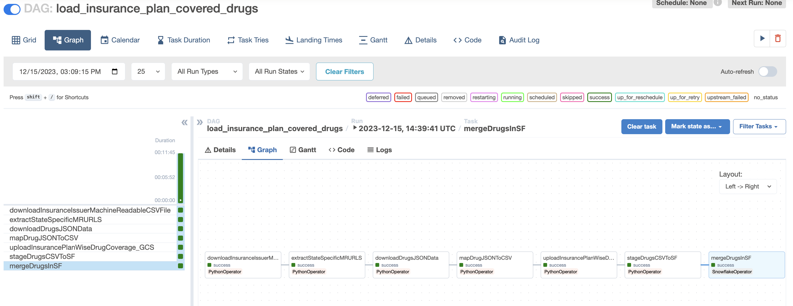

# HealthPlanIQ: Insurance Chat Bot Project Overview

## Project Description:
HealthPlanIQ is an interactive web application designed to provide users with personalized information and assistance related to health insurance. The project integrates a conversational chatbot powered by OpenAI models and a sophisticated SQL query generation system linked to a Snowflake database. The goal is to offer users a seamless experience when seeking health insurance information and to provide context-aware responses.

> **Disclaimer:**
> 
> This bot is designed to provide insights about insurance plans. Before purchasing any plans, we strongly recommend to thoroughly read the documents and consulting subject matter experts.

## Links
- ChatBot Application - [link](https://damg7245-team7-healthplaniq-insurance-chat-bot.streamlit.app)
- Codelab Document - [link](https://codelabs-preview.appspot.com/?file_id=1IsF863dSaATDAfqRkESQvZwO_PFKVhCErxk7iqaILcY#0)
- Video Demo - [link](https://youtu.be/KiZ09Yul0h0?si=NIQoC-PV-DVvljFg)
- LangChain - [link](https://python.langchain.com/docs/get_started)
- Snowflake Tutorial - [link](https://quickstarts.snowflake.com/guide/data_engineering_pipelines_with_snowpark_python/index.html?index=..%2F..index#0)
- Airflow - [link](https://airflow.apache.org/docs/apache-airflow/stable/start.html)
- Open AI Cookbook - [link](https://github.com/openai/openai-cookbook/tree/main/examples/fine-tuned_qa)
- Streamlit - [link](https://docs.streamlit.io/library/get-started) 

## Architecture 



## Team Members

### Aditya Kawale
- **NUID:** 002766716
- **Email:** [kawale.a@northeastern.edu](mailto:kawale.a@northeastern.edu)

### Nidhi Singh
- **NUID:** 002925684
- **Email:** [singh.nidhi1@northeastern.edu](mailto:singh.nidhi1@northeastern.edu)

### Uddhav Zambare
- **NUID:** 002199488
- **Email:** [zambare.u@northeastern.edu](mailto:zambare.u@northeastern.edu)

## Few Snapshots

Application:




Airflow:






## Data Sources
Dataset
Details
Source


### Individual & families health plan**
Statewise issuers, health plans, premium rates for age/family types etc.
[link](https://www.healthcare.gov/health-and-dental-plan-datasets-for-researchers-and-issuers/) 

**Plan benefits**
(Benefits and Cost Sharing PUF)
Healthcare plan benefits that consumers get after enrolling
[link](https://www.cms.gov/marketplace/resources/data/public-use-files)

**Health plan quality ratings**
(Quality PUF)
Healthcare plan wise quality ratings
[link](https://www.cms.gov/medicare/quality-initiatives-patient-assessment-instruments/qualityinitiativesgeninfo/aca-mqi/downloads/mqi-downloads)

**Machine Readable PUF**
Drugs covered in the plans per issuer
[link](https://www.cms.gov/medicare/quality-initiatives-patient-assessment-instruments/qualityinitiativesgeninfo/aca-mqi/downloads/mqi-downloads)


## Application Flow

### Gathering Data for the chatbot application

1. **Airflow Pipelines**
   - Pipeline 1 (load_insurance_plans.py): Captures the details regarding insurance plans like insurance issuers, geographic information, insurance plan name, premiums, deductibles, etc. from yearly uploaded EXCEL file
   - Pipeline 2 (load_insurance_plan_benefits.py): Captures details regarding benefits covered by different insurance plans from a yearly uploaded CSV file
   - Pipeline 3 (load_insurance_plan_covered_drugs.py): Captures details regarding prescription drugs covered by the insurance plans and their tier details. This data primarily comes from APIs hosted by individual insurance providers. A EXCEL file indicating the drug APIs helps in gaining access to issuer's API landscape
   - Pipeline 4 (load_insurance_plan_quality_ratings.py): Captures details regarding overall ratings, member experience ratings w.r.t insurance plans. This data comes from yearly uploaded EXCEL file 

   The Airflow pipelines primarily scrape the web-hosted data by making HTTP calls, clean the data and stage the data in Google Cloud Storage buckets. These buckets later act as external stages for snowflake data syncing.
   
2. **Snowflake Pipelines**
   - Snowflake DW acts as the central repository for all the insurance plans related data.
   - Snowflake stored procedures are written for every table - they help in syncing the data from GCS CSV files to Snowflake tables using commands like COPY and MERGE
   - These stored procedures are parameterized, which expect a GCS saved CSV file, whose data needs to be synced with Snowflake tables

### Initiate Chat

1. **Input Information**
   - Users start by entering their state, county, and optionally, the insurance plan ID on the home page.

2. **Chatting with HealthPlanIQ**
   - Users proceed to the HealthPlanIQ chat bot, where they can initiate conversations by typing questions or using provided suggestions.

### Behind the Scenes

The magic happens behind the scenes through a multi-step process:

1. **SQL Query Generator**
   - User questions are sent to OpenAI via LangChain, utilizing an LLM model as an SQL generator.
   - LangChain creates a conversation chain with memory, engineering the LLM model with database tables and columns.
   - The model generates a SQL query to select relevant data based on user queries.

2. **Query Validation and Data Retrieval**
   - The generated SQL query is validated to ensure it is not a DDL or DML statement.
   - Valid queries trigger data retrieval from the Snowflake database.

3. **Insurance Agent Analysis**
   - The extracted data is sent to another OpenAI model, playing the role of an Insurance Agent.
   - The agent analyzes the data, providing answers to user queries and suggesting three follow-up questions.
   - The analysis is sent in JSON format using the StructuredOutputParser class from LangChain.

### User Interaction

- The analyzed results are returned to the chat bot in JSON format.
- The chat bot displays the information to the user in a user-friendly format.

## Steps to access HealthPlanIQ ChatBot:

You can be directly access HealthPlanIQ ChatBot from Streamlit Cloud via [link](https://damg7245-team7-healthplaniq-insurance-chat-bot.streamlit.app/)

**OR**

#### 1. Clone the Repository:
```bash
git clone https://github.com/your-username/your-repository.git
cd your-repository/frontend
```

#### 2. Install Dependencies:
```bash
pip install -r requirements.txt
```

#### 3. Create `secrets.toml`:
Create a `secrets.toml` file in the `frontend/.streamlit` directory with required secrets.

```toml
# secrets.toml

## Snowflake
user = "your_snowflake_user"
password = "your_snowflake_password"
account = "your_snowflake_account"
warehouse = "your_snowflake_warehouse"
database = "your_snowflake_database"
schema = "your_snowflake_schema"
role = "your_snowflake_role"
client_session_keep_alive = true

# Open_AI
openai_api_key = "your_openai_api_key"
openai_model = "your_openai_model"
```

#### 4. Run Streamlit App:
```bash
streamlit run Home.py
```

#### 5. Access the App:
Open a web browser and visit `http://localhost:8501`.

Note:
- Ensure Python is installed.
- Review terminal messages for troubleshooting.
- Adjust steps based on your project configuration.

## Features

- *User-Friendly Interface*: Guides users through easy information input.
- *Information Collection*: Collects state, county, and optional plan ID via a well-designed form.
- *Input Validation*: Validates state, county, and plan ID; checks plan ID in Snowflake database.
- *ChatBot Interaction*: Employs OpenAI-powered chatbot for natural language conversations and insurance info.
- *Dynamic Interaction*: Varies responses based on user location and plan ID.
- *SQL Query Generation*: Generates SQL queries robustly using OpenAI models.
- *Context-Based Response*: Integrates SQL query responses, suggests follow-up insurance questions.
- *User Memory*: Tracks chat history and queries for enhanced context.
- *Continuous Interaction*: Users ask more questions, seek clarification seamlessly.

## Contribution
*   Aditya : 33`%` 
*   Nidhi : 33`%`
*   Uddhav : 34`%`

## Individual Distribution

| **Developer** |          **Deliverables**          	              |
|:-------------:|:-------------------------------------------------:|
|      Aditya   | Airflow pipelines                                 |
|      Aditya   | Snowflake data modeling                           |
|      Aditya   | Github code integration                           |
|      Uddhav   | Prompt engineering to retrive SQL query.          |
|      Uddhav   | Q&A ChatBot model creation                        |
|      Uddhav   | Streamlit application and deployment              |
|      Nidhi    | Data engineering and cleaning                     |
|      Nidhi    | Query generator to enchance efficency             |
|      Nidhi    | Data Research and Documentation                   |


> WE ATTEST THAT WE HAVEN’T USED ANY OTHER STUDENTS’ WORK IN OUR ASSIGNMENT AND ABIDE BY THE POLICIES LISTED IN THE STUDENT HANDBOOK.


